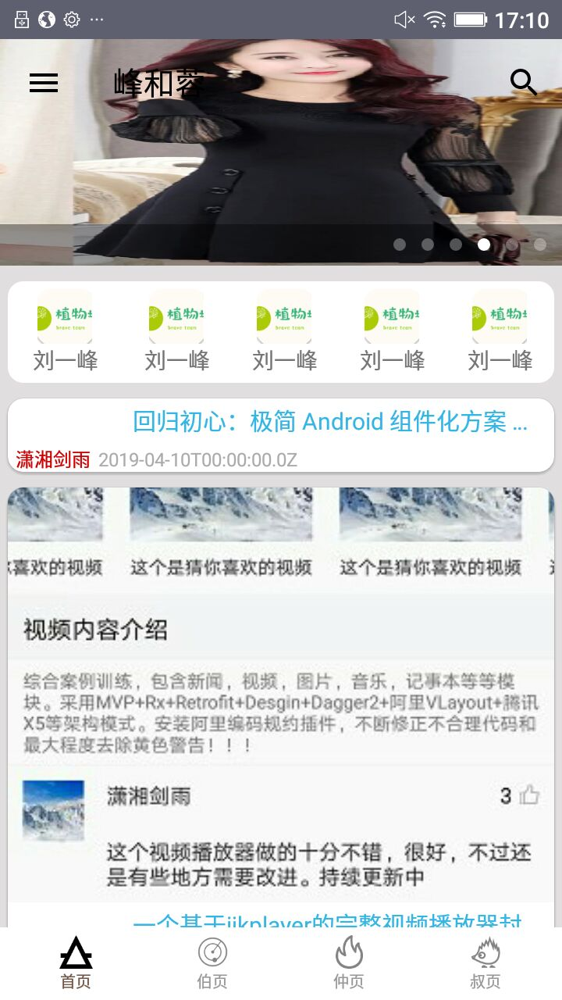
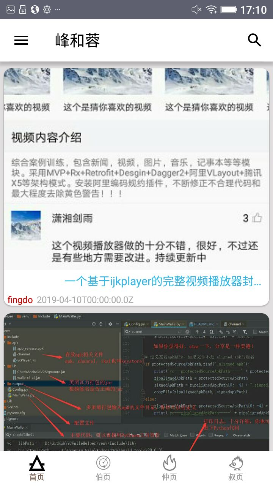
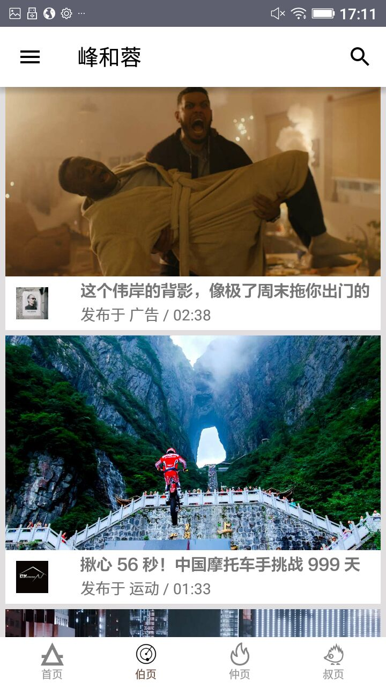
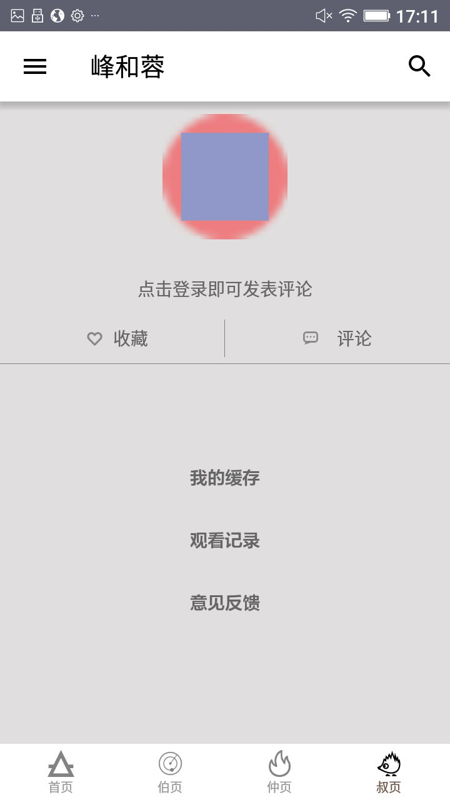

[![Platform][1]][2]

[1]:https://img.shields.io/badge/platform-Android-blue.svg  
[2]:https://github.com/iMeiji/Toutiao

# FrameConstruct
FrameConstruct客户端,是我的一个练手的习作，其中采用了MVP的架构，基于Material Design设计风格，采用了Rxjava,Retrofit,OkHttp,dagger等各种框架,
使用的语言是kotlin

## Statement
程序中的API，来自网络上广为流API接口，本人只是用于学习使用，并没有任何的盈利行为

## Features
- 首页五大模块:  首页/ 伯页 / 仲页 / 叔页
- 第一个模块：实现了数据的展示和可以在透明和不同命之间根据banner是否显示进行切换。
- 第二个模块：实现了视频播放。
- 第三个模块：一个瀑布利
- 第四个模块：个人页面

## Screenshots

## Preview

##Point
- 这个项目采用的是kotlin进行编写的
- 采用了模块化的结构，模块之间通过ARout进行通信，模块之间互补依赖，实现了解耦的目的。

## End
注意：此开源项目仅做学习交流使用, 不可用于任何商业用途. 如果你觉得不错, 对你有帮助, 欢迎点个 fork, star, follow , 也可以帮忙分享给你更多的朋友, 这是给作者最大的动力与支持

